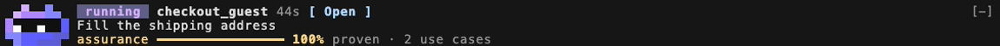

# kane-claude-plugin

**kane-qe** is a [Claude Code](https://claude.com/claude-code) plugin (a mod) that watches [kane-cli](https://github.com/LambdaTest/kane-cli) ([KaneAI](https://www.lambdatest.com/kane-ai)) and shows what it is doing, without being asked.

Claude runs kane-cli; the mod reads what kane-cli leaves on disk and draws it: a band of three rows above the prompt with the kane mascot, and a pane for runs, assurance and history. When Claude changes code and nothing has tested it, the band says so and offers a test.



**Read more:** the [Field Guide](docs/index.html) (every band state, the pane, flows, use cases, guidelines, and a chaptered walkthrough video recorded with real runs: [docs/kane-qe-v2-tour.mp4](docs/kane-qe-v2-tour.mp4)) and [Explained simply](docs/explainer.html). Both are standalone pages: open them from a clone. [How v2 meets its design](guide/v2/design-coverage.md) lists every designed feature and screen and how it was checked.

## Install

Requirements: Claude Code with mods (function-hook plugins), and kane-cli: `npm install -g @testmuai/kane-cli`, then `! kane-cli login --oauth` from the Claude prompt.

In Claude Code:

```
/plugin marketplace add LambdaTest/kane-claude-plugin
/plugin install kane-qe@lambdatest
```

From a terminal: `claude plugin marketplace add LambdaTest/kane-claude-plugin`, then `claude plugin install kane-qe@lambdatest`.

- **Pin a release or branch** by adding `#ref`: `LambdaTest/kane-claude-plugin#kane-qe--v2.0.0`.
- **Updates:** `claude plugin update kane-qe@lambdatest`, then `/reload-plugins` in a running session. Background auto-update is off by default for this marketplace; turn it on in `/plugin` → Marketplaces, or with `"autoUpdate": true` below.
- **Without the marketplace**, from a clone: `claude --plugin-dir kane-claude-plugin/kane-qe`, or name that folder in `env.CLAUDE_CODE_PLUGIN_DIRS` in `~/.claude/settings.json`.

### Roll it out to a team

Commit this to a project's `.claude/settings.json`; everyone who opens the project and trusts it gets the marketplace and the plugin:

```json
{
  "extraKnownMarketplaces": {
    "lambdatest": {
      "source": { "source": "github", "repo": "LambdaTest/kane-claude-plugin" },
      "autoUpdate": true
    }
  },
  "enabledPlugins": {
    "kane-qe@lambdatest": true
  }
}
```

The same block works in `~/.claude/settings.json` (every project on one machine) and in organization managed settings (claude.ai → Admin settings → Claude Code → Managed settings, or managed settings on each machine).

## How to use it

Nothing to start. Open Claude Code in a project and the band is there.

1. **Ask Claude to test something**: "run `kane-cli run "Search for iPod and assert 4 products are listed" --url https://ecommerce-playground.lambdatest.io --agent --headless`", or "run the login test with kane-cli". Within two seconds the band shows the run, its time and the step it is on. A run started in a terminal in the same folder shows up the same way.
2. **Read the card**: each test Claude runs leaves a card in the conversation with its result, and *View evidence* opens the evidence in the browser.
3. **Open the pane** with `/kane` or `[ Open ]`. Press a run for its steps; the current or failing step opens to what the agent thinks, does and checks.
4. **When a test fails**, the band names it and the step; the run's detail gives kane's own verdict (why, what kind, how sure, where) and *Open evidence*.
5. **Several runs or a suite**: one coloured cell per run or test, with counts; a failure takes row 2 while the rest keep going. A suite on the remote grid (`--remote`) shows how many tests are on the grid and since when; the pane gives the job and its link, and the tests are counted when the job ends.
6. **After Claude changes code**, the band warns *⚠ 1 file changed, untested* with *Test this change*: saved tests that cover the change (with their last result), or an objective Claude drafts from the diff. `/kane auto` makes Claude test before it finishes; `/kane off` turns it off.
7. **Assurance**: row 3 is requirement coverage from `kane-cli cover gaps --json`; the Assurance tab breaks it down per use case, or offers to set it up. Press a use case to see what it still owes and kane-cli's next command for each; *Close these gaps with Claude* hands it over.
8. **History**: the History tab lists the last 30 finished runs in this project, with where each failed.

| Command | |
|---|---|
| `/kane` | Open the pane |
| `/kane assurance` | Open the Assurance tab |
| `/kane history` | Open the History tab |
| `/kane auto` · `/kane ask` · `/kane off` | What happens after Claude changes code, for this session |

`/config` → kane-qe: **After Claude changes code** (`offer` by default, `auto`, `off`) and **kane-cli command** (default `kane-cli`, used only for the read-only `cover gaps`). Colours follow Claude Code's theme.

What it never does: it never starts a kane-cli test, and never shows what kane-cli did not report. The commands it runs are `kane-cli cover gaps --json`, `kill -0`, `ps`, `git check-ignore` and `git diff`, and, only when you press *View evidence*, `kane-cli evidence serve <pack>` and `open`. It reads kane-cli's structured output only, with one exception: the viewer link that `evidence serve` prints.

## How to publish it on Claude

### 1. Check it

```
claude plugin validate kane-qe --strict     # the plugin: manifest, hooks, state contract
claude plugin validate . --strict           # the marketplace manifest
claude plugin test kane-qe                  # 127 tests
```

CI (`.github/workflows/ci.yml`) runs the same on every push to `main` and on pull requests.

### 2. Release a version

1. Raise `version` in `kane-qe/.claude-plugin/plugin.json` and in the plugin's entry in `.claude-plugin/marketplace.json` (`claude plugin tag` checks they agree).
2. Commit and push to `main`.
3. Tag the release: `claude plugin tag kane-qe --push` creates and pushes `kane-qe--v<version>`, which people can pin with `#kane-qe--v<version>`.

People get it with `claude plugin update kane-qe@lambdatest` (or by auto-update), then `/reload-plugins`.

### 3. Distribute it

- **This repository as a marketplace** (above): anyone adds it once.
- **A team or the whole organization**: the settings block above, in a project's `.claude/settings.json` or in managed settings. Managed settings can also restrict hooks to organization-approved mods (`allowManagedModsOnly`).

### 4. Submit it to Anthropic's plugin directory

To list kane-qe in the plugin directory on claude.ai, so anyone can find and enable it:

1. Make sure `claude plugin validate kane-qe --strict` passes, `plugin.json` has `name`, `version`, `description`, `author`, `homepage` and `repository`, and the plugin folder has a `README.md` (all true today).
2. Open [claude.ai/directory/manage](https://claude.ai/directory/manage) (a paid plan; for an organization, the Owner role) and follow *Submit a plugin*. The steps are in [Submit a plugin](https://claude.com/docs/plugins/submit).
3. Anthropic reviews it. Once published, people who enable it on claude.ai get it in Claude Code as `kane-qe@synced`.
4. For an update: raise `version`, push, and submit the new version in the same portal.

References: [install plugins](https://code.claude.com/docs/en/plugins/install), [publish](https://code.claude.com/docs/en/plugins/publish), [host a marketplace](https://code.claude.com/docs/en/plugins/host-marketplace), [organization settings](https://code.claude.com/docs/en/plugins/org), [mods reference](https://code.claude.com/docs/en/plugins/mods/reference).

## Develop

| Path | What |
|---|---|
| `kane-qe/hooks/adapter.ts` | One kane-cli wire line → a small internal event: the only place raw field names appear |
| `kane-qe/hooks/model.ts` | Pure: events → runs, runs → the band's rows and the pane's text, cover gaps, change helpers |
| `kane-qe/hooks/sources.ts` | The live-run pointer and byte offsets into event files |
| `kane-qe/hooks/register.tsx` | Polling, hooks (edits, end of turn, `/kane`, theme) and the drawing |
| `kane-qe/hooks/mascot.ts` | The mascot: a cell grid in terminals, an image elsewhere |
| `kane-qe/tests/` | Adapter table, band states at 60/80/120 columns, recorded kane-cli streams replayed, band and pane on terminal and desktop, change tracking, stale pointers, assurance and use-case detail, remote suites, history, the card in the chat, theme |
| `.claude-plugin/marketplace.json` | The `lambdatest` marketplace: this repository installs with `/plugin marketplace add` |
| `docs/` | The Field Guide and the explainer as standalone HTML, with the walkthrough video and screenshots (`guide/build_docs.sh` rebuilds them) |
| `guide/` | The page sources, screenshots, design coverage, and the script that records the walkthrough (`KANE_DEMO_DIR=<project> guide/run_tour_v2.sh`) |

Edit `kane-qe/` and a session that loads it with `--plugin-dir` or `CLAUDE_CODE_PLUGIN_DIRS` reloads it on save. After recording a new kane-cli stream into `kane-qe/tests/fixtures/`, run `node kane-qe/tests/fixtures/build.mjs`.

## License

[MIT](LICENSE)
